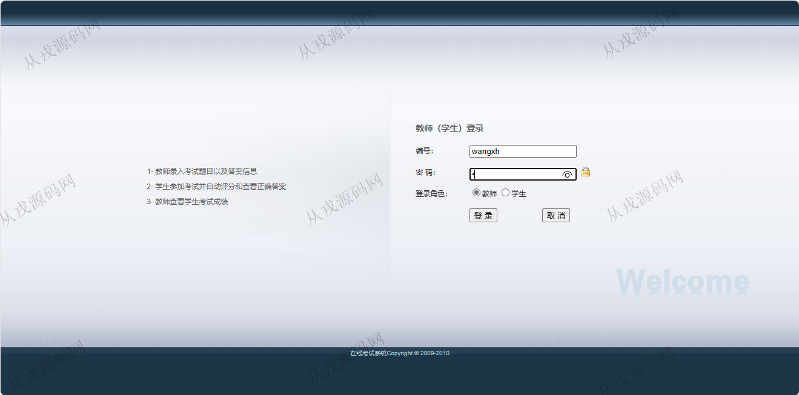
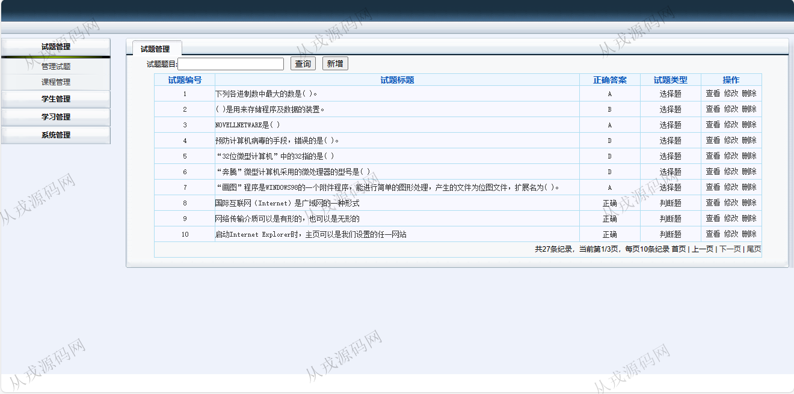
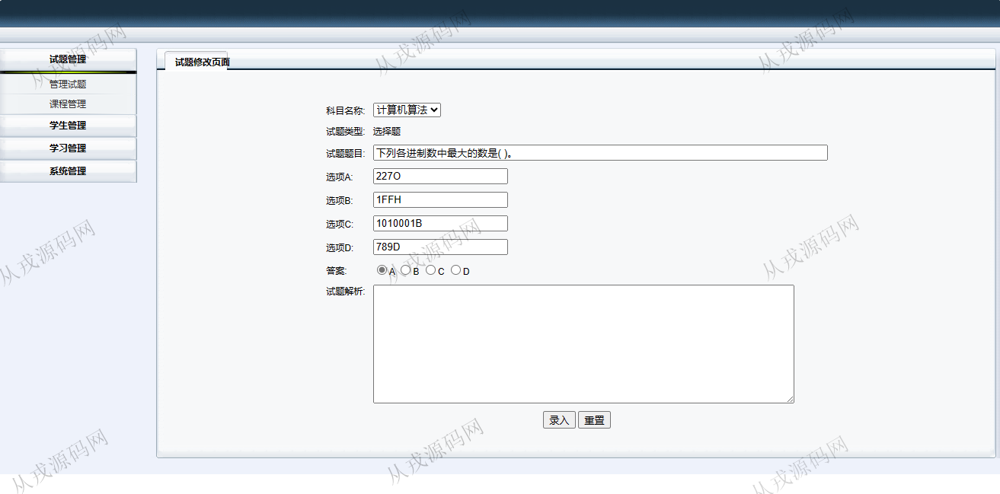
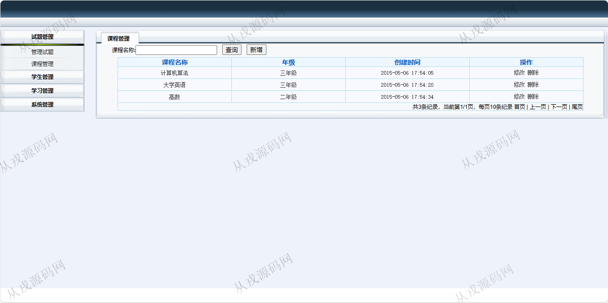
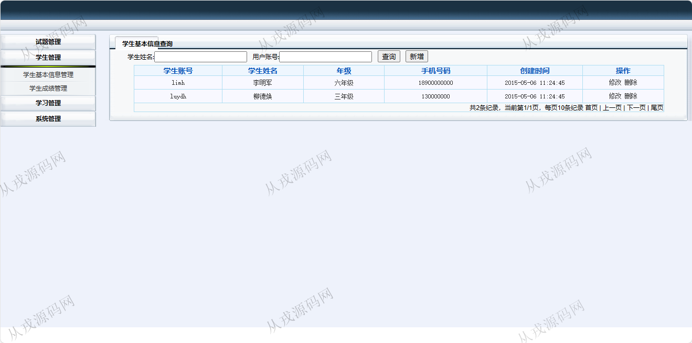
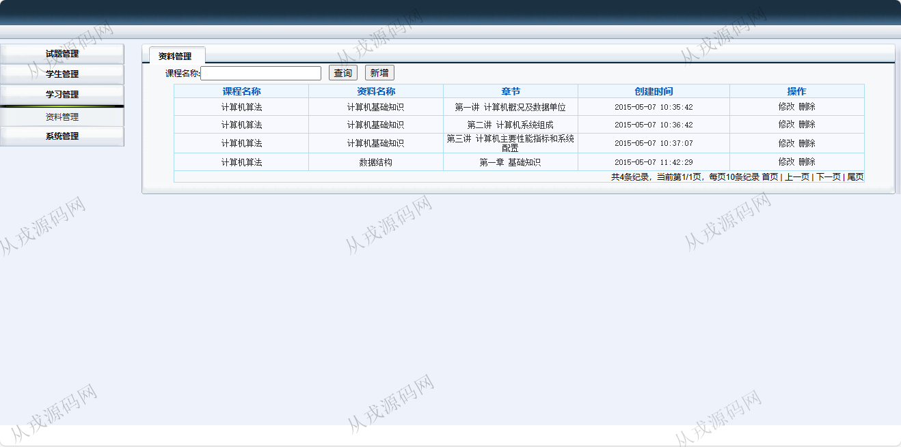
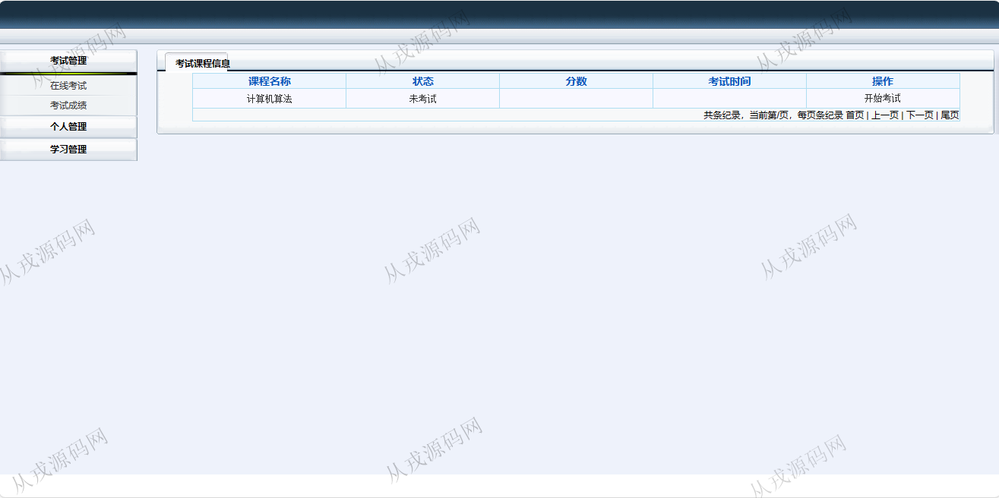
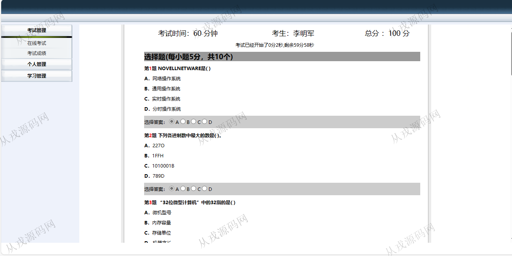
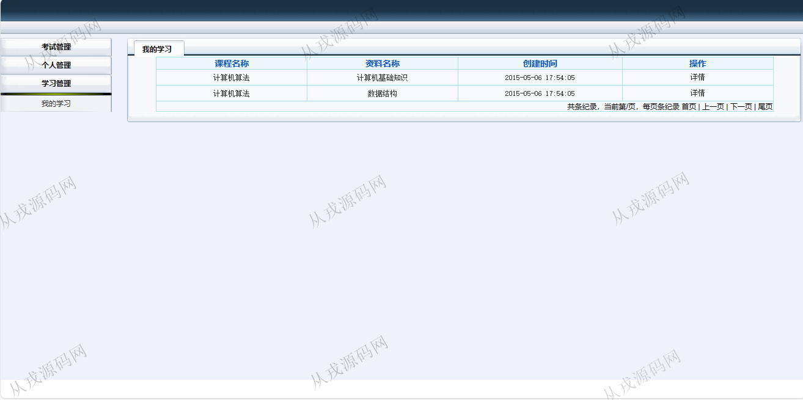

<h1 align="center">94.学生在线考试管理系统</h1>

 获取sql文件 QQ: 386869957 QQ群: 377586148 

 [推荐站点: 从戎源码网](https://armycodes.com/) 

## 简介

> 本代码来源于网络,仅供学习参考使用!
>
> 提供1.远程部署/2.修改代码/3.设计文档指导/4.框架代码讲解等服务
>
> 访问地址：http://localhost:8080/
> 
> 教师：wangxh 1
> 
> 学生：limh 1
> 

## 项目介绍
基于ssh的学生在线考试管理系统：前端 jsp、jquery，后端 struts、spring、hibernate，角色分为教师、学生；集成试题管理、课程管理、学生管理，资料管理等功能于一体的系统。

## 功能介绍

### 学生

- 在线考试：考试课程列表查询，开始考试操作，在线考试答题，提交答卷
- 考试成绩：学生在线考试完成后，系统自动评分，提交答卷后即可查询自己本次的考试成绩
- 个人管理：学生基本信息的查看与修改，只能查询本人自己的信息
- 我的学习：我学习的课程列表记录查询

### 教师

- 管理试题：试题信息的增删改查，试题类型分为选择题和判断题，可附加试题解析内容
- 课程管理：课程信息的增删改查
- 学生管理：学生信息的增删改查，学生成绩管理
- 学习管理：学习资料的增删改查
- 系统管理：用户信息的增删改查，角色信息的增删改查，资源信息的增删改查

## 环境

- <b>IntelliJ IDEA 2021.3</b>

- <b>Mysql 5.7.26</b>

- <b>Tomcat 7.0.73</b>

- <b>JDK 1.8</b>

## 运行截图

